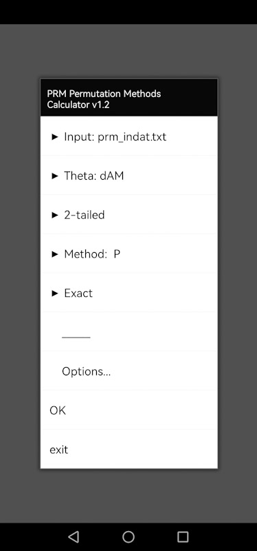
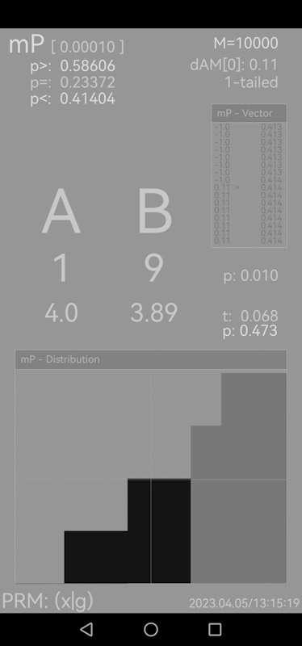

# PRM

[Demo movie](https://m.youtube.com/watch?v=rSWb_eTAjSk&t=0s)

Permutation Methods Calculator `PRM` (in development). Android application for the calculation of *permutation tests*, where

$$p(x)=p(\theta_{(x)} \ge \Theta_{(x)}|H_0), 0\le p\le1,$$

$$p=\frac{1}{M}⋅\sum_{i=1}^M\theta_{(i)}\ge\Theta_{(x)},$$

first mentioned by Fisher ([1935](https://psycnet.apa.org/record/1939-04964-000)), based on his own account of experiments in agriculture (Fisher, [1926](https://doi.org/10.23637/rothamsted.8v61q)) and the work by Neyman ([1923](https://link.springer.com/chapter/10.1007/978-94-015-8816-4_10)).

See further Pitman ([1937a](http://www.jstor.org/stable/2984124), [b](http://www.jstor.org/stable/2983647), [1938](http://www.jstor.org/stable/2332008)), Fisher ([1966](https://scirp.org/reference/referencespapers.aspx?referenceid=895747), [1971](https://home.iitk.ac.in/~shalab/anova/DOE-RAF.pdf)), Cox and Hinkley ([1974](https://doi.org/10.1201/b14832)), Schrausser ([1996](https://zenodo.org/records/11529663), p. 4-22 ff., [1998a](https://doi.org/10.5281/zenodo.11673333), [b](http://doi.org/10.13140/rg.2.2.19532.69768), [2022](https://www.academia.edu/82224369/Introduction)), Edgington and Onghena ([2007](https://doi.org/10.1201/9781420011814)) or Scambor and Schrausser ([2023](https://www.academia.edu/94993376/Introduction_part_II_permutation_tests_for_repeated_measurement_designs_)), also Schrausser ([2024](https://doi.org/10.31234/osf.io/rvzxa), p. 29).

**Figure 1.** 

**Figure 2.** 

## Example 1 
(c.f. Schrausser, [1998a](https://doi.org/10.5281/zenodo.11673333)).

**Figure 3.** 

**Figure 4.** 

## Example 2 
(c.f. Schrausser, [1998b](http://doi.org/10.13140/rg.2.2.19532.69768)).

**Figure 5.** 

**Figure 6.** 

## References

Cox, D. R., & Hinkley, D. V. (1974). *Theoretical Statistics* (1st ed). New York: Chapman and Hall/CRC. `eBook ISBN 9780429170218` [DOI:10.1201/b14832](https://doi.org/10.1201/b14832)

Edgington, E. S., & Onghena, P. (2007). *Randomization tests* (4th ed). New York: Chapman and Hall/CRC. `ISBN 9780367577711, eBook ISBN 9780429142710` [DOI:10.1201/9781420011814](https://doi.org/10.1201/9781420011814)

Fisher, R. A. (1926). The Arrangement of Field Experiments. *Journal of the Ministry of Agriculture, 33*, 503–15. [DOI:10.23637/rothamsted.8v61q](https://doi.org/10.23637/rothamsted.8v61q)

———. (1935). *The Design of Experiments*. 1st ed. Edinburgh: Oliver & Boyd. [https://psycnet.apa.org/record/1939-04964-000](https://psycnet.apa.org/record/1939-04964-000)

———. (1966). *The Design of Experiments*. 8th ed. Edinburgh: Hafner. [https://scirp.org/reference/referencespapers.aspx?referenceid=895747](https://scirp.org/reference/referencespapers.aspx?referenceid=895747)

———. (1971). *The Design of Experiments*. 9th ed. New York: Hafner Press. [https://home.iitk.ac.in/~shalab/anova/DOE-RAF.pdf](https://home.iitk.ac.in/~shalab/anova/DOE-RAF.pdf)

Neyman, J. (1923). Sur les applications de la theorie des probabilites aux experience agricoles: Essay de principes. *Roczniki Nank Polniczek, 10*, 1–51. [https://link.springer.com/chapter/10.1007/978-94-015-8816-4_10](https://link.springer.com/chapter/10.1007/978-94-015-8816-4_10)

Pitman, E. J. G. (1937a). Significance Tests Which May Be Applied to Samples from Any Populations. *Supplement to the Journal of the Royal Statistical Society, 4*(1), 119–30. [http://www.jstor.org/stable/2984124](http://www.jstor.org/stable/2984124)

———. (1937b). Significance Tests Which May Be Applied to Samples from Any Populations. II. The Correlation Coefficient Test. *Supplement to the Journal of the Royal Statistical Society, 4*(2), 225–32. [http://www.jstor.org/stable/2983647](http://www.jstor.org/stable/2983647)

———. (1938). Significance Tests Which May Be Applied to Samples from Any Populations: III. The Analysis of Variance Test. *Biometrika, 29*(3/4), 322–35. [http://www.jstor.org/stable/2332008](http://www.jstor.org/stable/2332008)

Scambor, C., & Schrausser, D. G. (2023). Introduction (part II, permutation tests for repeated measurement designs).  In:  *Permutation methods in single case studies:...*. Thesis. Karl Franzens University, Institute of Psychology. Academia. [www.academia.edu/94993376](https://www.academia.edu/94993376/Introduction_part_II_permutation_tests_for_repeated_measurement_designs_)

Schrausser, D. G. (1996). Permutationstests: Theoretische und praktische Arbeitsweise von Permutationsverfahren beim unverbundenen 2 Stichprobenproblem. *Diplom*. Institut für Psychologie, Karl Franzens Universität, Graz. [DOI:10.13140/RG.2.2.24500.32640/1](https://zenodo.org/records/11529663)

———. (1998a). Exakte Verfahren oder Asymptotische Approximation. In: Glück. J., Jirasco, M., & Rollett, B. (Hrsg.) *Perspektiven psychologischer Forschung in Österreich*, Teil 2. WUV-Univ.-Verl., Wien. `ISBN 3851144414` [DOI:10.5281/zenodo.11673333](https://doi.org/10.5281/zenodo.11673333)

———. (1998b). Die Permutationsmethode: Voraussetzungsfrei testen. *41. Kongreß der Deutschen Gesellschaft für Psychologie (DGPs)*. Dresden. [DOI:10.13140/rg.2.2.19532.69768 ](http://doi.org/10.13140/rg.2.2.19532.69768)

———. (2022). Thesis chapter 1: Introduction. In: *Permutation tests:...*. Thesis. Karl Franzens University, Institute of Psychology. Academia. [www.academia.edu/82224369](https://www.academia.edu/82224369/Introduction)

———. 2024. *Handbook: Distribution Functions (Verteilungs Funktionen)*. PsyArXiv. [DOI:10.31234/osf.io/rvzxa](https://doi.org/10.31234/osf.io/rvzxa)
