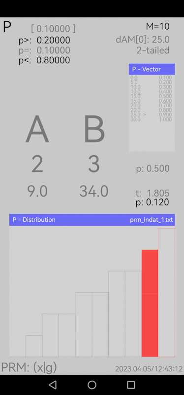
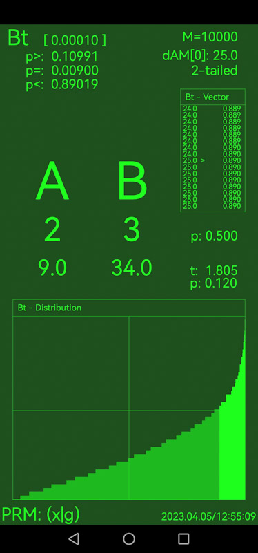
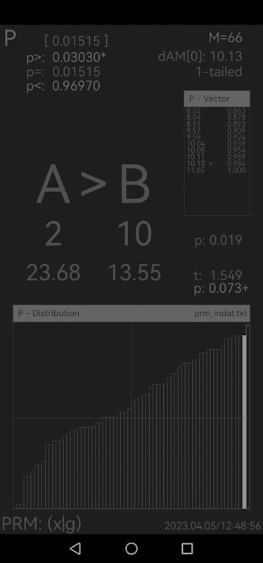

# PRM

[Demo movie](https://m.youtube.com/watch?v=rSWb_eTAjSk&t=0s)

Permutation Methods Calculator `PRM` (in development). Android application for the calculation of *permutation tests*, where

$$p(x)=p(\theta_{(x)} \ge \Theta_{(x)}|H_0), 0\le p\le1,$$

$$p=\frac{1}{M}⋅\sum_{i=1}^M\theta_{(i)}\ge\Theta_{(x)},$$

see Cox & Hinkley (1974), Schrausser (1996, p. 4-22 ff., 1998a, b, 2022), Edgington & Onghena (2007) or Scambor & Schrausser (2023), also Schrausser (2024, p. 29).

#### Example 1 (c.f. Schrausser, 1998a).

#### Example 2 (c.f. Schrausser, 1998b).

## References

Cox, D. R., & Hinkley, D. V. (1974). *Theoretical Statistics* (1st ed). New York: Chapman and Hall/CRC. `eBook ISBN 9780429170218` [DOI:10.1201/b14832](https://doi.org/10.1201/b14832)

Edgington, E. S., & Onghena, P. (2007). *Randomization tests* (4th ed). New York: Chapman and Hall/CRC. `ISBN 9780367577711, eBook ISBN 9780429142710` [DOI:10.1201/9781420011814](https://doi.org/10.1201/9781420011814)

Scambor, C., & Schrausser, D. G. (2023). Introduction (part II, permutation tests for repeated measurement designs).  In:  *Permutation methods in single case studies:...*. Thesis. Karl Franzens University, Institute of Psychology. Academia. [www.academia.edu/94993376](https://www.academia.edu/94993376/Introduction_part_II_permutation_tests_for_repeated_measurement_designs_)

Schrausser, D. G. (1996). Permutationstests: Theoretische und praktische Arbeitsweise von Permutationsverfahren beim unverbundenen 2 Stichprobenproblem. *Diplom*. Institut für Psychologie, Karl Franzens Universität, Graz. [DOI:10.13140/RG.2.2.24500.32640/1](http://doi.org/10.13140/RG.2.2.24500.32640/1)

———. (1998a). Exakte Verfahren oder Asymptotische Approximation. In: Glück. J., Jirasco, M., & Rollett, B. (Hrsg.) *Perspektiven psychologischer Forschung in Österreich*, Teil 2. WUV-Univ.-Verl., Wien. `ISBN 3851144414` [DOI:10.5281/zenodo.11673333](https://doi.org/10.5281/zenodo.11673333)

———. (1998b). Die Permutationsmethode: Voraussetzungsfrei testen. *41. Kongreß der Deutschen Gesellschaft für Psychologie (DGPs)*. Dresden. [DOI:10.13140/rg.2.2.19532.69768 ](http://doi.org/10.13140/rg.2.2.19532.69768)

———. (2022). Thesis chapter 1: Introduction. In: *Permutation tests:...*. Thesis. Karl Franzens University, Institute of Psychology. Academia. [www.academia.edu/82224369](https://www.academia.edu/82224369/Introduction)

———. 2024. Handbook: *Distribution Functions (Verteilungs Funktionen)*. PsyArXiv. [DOI:10.31234/osf.io/rvzxa](https://doi.org/10.31234/osf.io/rvzxa)
